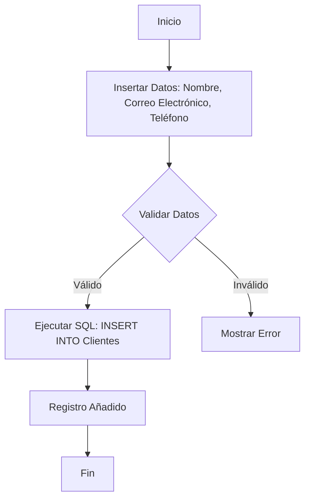
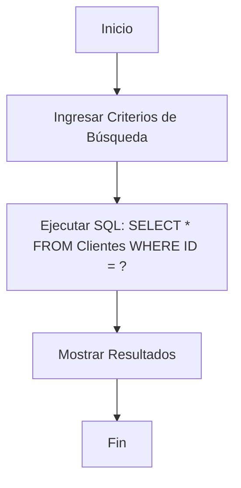
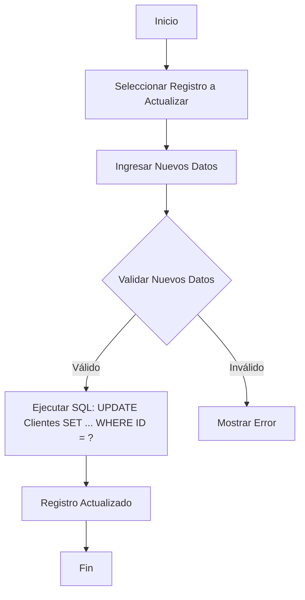
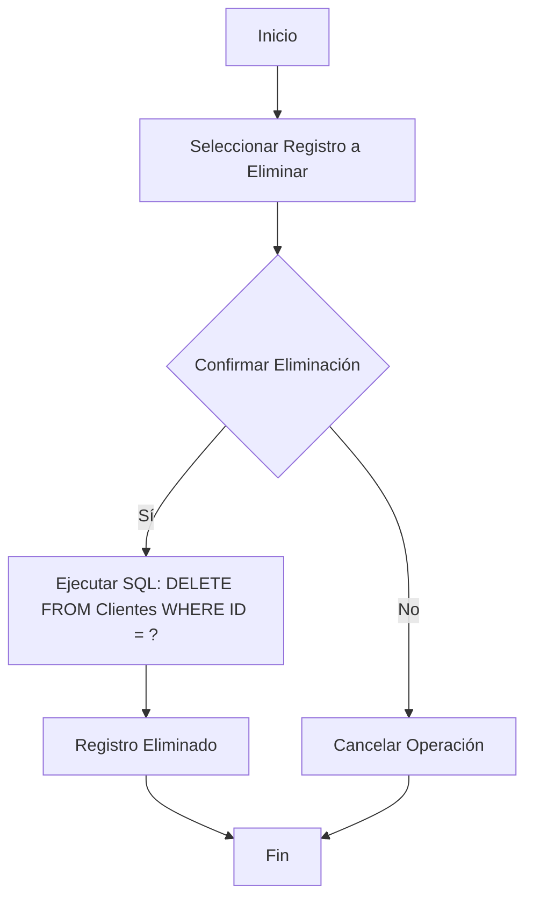

### Operaciones CRUD

Las operaciones CRUD (Create, Read, Update, Delete) son las cuatro operaciones básicas que se pueden realizar en una base de datos para gestionar los datos. Estas operaciones permiten a los usuarios interactuar con la base de datos de manera eficiente y son fundamentales en cualquier sistema de gestión de bases de datos.

#### Crear (Create)

La operación **Crear** se utiliza para agregar nuevos registros a una tabla de la base de datos.

```sql
-- Crear una tabla de ejemplo
CREATE TABLE Clientes (
    ID INT PRIMARY KEY,
    Nombre VARCHAR(100),
    Correo_Electronico VARCHAR(100),
    Telefono VARCHAR(15)
);

-- Insertar un nuevo registro en la tabla Clientes
INSERT INTO Clientes (ID, Nombre, Correo_Electronico, Telefono)
VALUES (1, 'John Doe', 'john.doe@example.com', '123-456-7890');

```

#### Diagrama de Create
1. **Input**: Datos a insertar (por ejemplo, nombre, correo electrónico, teléfono).
2. **Proceso**: SQL `INSERT` statement.
3. **Output**: Nuevo registro en la base de datos.


#### Leer (Read)

La operación **Leer** se utiliza para recuperar datos de una o más tablas de la base de datos.

```sql
-- Seleccionar todos los registros de la tabla Clientes
SELECT * FROM Clientes;

-- Seleccionar registros específicos con una condición
SELECT * FROM Clientes WHERE ID = 1;
```

#### Diagrama de Read
1. **Input**: Criterios de selección (por ejemplo, ID del cliente).
2. **Proceso**: SQL `SELECT` statement.
3. **Output**: Datos del registro recuperado.



#### Actualizar (Update)

La operación **Actualizar** se utiliza para modificar los datos existentes en una tabla de la base de datos.
```sql
-- Actualizar el correo electrónico de un cliente específico
UPDATE Clientes
SET Correo_Electronico = 'john.newemail@example.com'
WHERE ID = 1;
```

#### Diagrama de Update

1. **Input**: Datos a actualizar y criterios de selección.
2. **Proceso**: SQL `UPDATE` statement.
3. **Output**: Registro actualizado en la base de datos.




#### Eliminar (Delete)
```sql
-- Eliminar un registro específico de la tabla Clientes
DELETE FROM Clientes
WHERE ID = 1;
```

#### Diagrama de Delete

1. **Input**: Criterios de selección (por ejemplo, ID del cliente).
2. **Proceso**: SQL `DELETE` statement.
3. **Output**: Registro eliminado de la base de datos.



### Ejemplo Completo
```sql
-- Crear la tabla Clientes
CREATE TABLE Clientes (
    ID INT PRIMARY KEY,
    Nombre VARCHAR(100),
    Correo_Electronico VARCHAR(100),
    Telefono VARCHAR(15)
);

-- Crear: Insertar nuevos registros en la tabla Clientes
INSERT INTO Clientes (ID, Nombre, Correo_Electronico, Telefono)
VALUES (1, 'John Doe', 'john.doe@example.com', '123-456-7890'),
       (2, 'Jane Smith', 'jane.smith@example.com', '098-765-4321');

-- Leer: Seleccionar todos los registros de la tabla Clientes
SELECT * FROM Clientes;

-- Leer: Seleccionar un registro específico
SELECT * FROM Clientes WHERE ID = 2;

-- Actualizar: Modificar el nombre de un cliente
UPDATE Clientes
SET Nombre = 'Jane Doe'
WHERE ID = 2;

-- Eliminar: Borrar un registro de la tabla Clientes
DELETE FROM Clientes
WHERE ID = 1;

```
****
###### Temas relacionados
[[Tipos de Datos en Base de datos]]
[[Tipos de sentencias SQL]]
****


