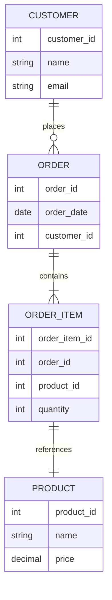

### Concepto de Base de Datos

Una base de datos es una colección organizada de datos que se almacena y se accede electrónicamente desde un sistema informático. Las bases de datos permiten a los usuarios almacenar, modificar y extraer información de manera eficiente.

### Estructura de una Base de Datos

Las bases de datos pueden ser de varios tipos, pero generalmente se estructuran en:

- **Tablas**: Colecciones de datos organizados en filas y columnas.
- **Filas (Registros)**: Cada fila representa una única entrada de datos.
- **Columnas (Campos)**: Cada columna representa un atributo de los datos.
****
[[Que es una tabla]]
****

### Tipos de Bases de Datos

1. **Relacionales**: Organizan datos en tablas que pueden estar relacionadas entre sí.
2. **NoSQL**: Almacenan datos de manera no tabular (documentos, clave-valor, gráficos, etc.).

### Ejemplo de una Tabla de Base de Datos Relacional

### Componentes Principales

1. **DBMS (Database Management System)**: Sistema de gestión de bases de datos que permite crear, leer, actualizar y eliminar datos.
2. **SQL (Structured Query Language)**: Lenguaje de programación utilizado para gestionar y manipular bases de datos relacionales.

### Diagrama de Relación entre Tablas


### Funciones Clave de una Base de Datos

- **CRUD Operations**:
    - **Create**: Añadir nuevos datos.
    - **Read**: Recuperar datos existentes.
    - **Update**: Modificar datos existentes.
    - **Delete**: Eliminar datos existentes.

****
[[CRUD Operations|Operaciones CRUD]]
****

### Ejemplo de Consulta SQL

```sql
-- Crear una tabla de clientes
CREATE TABLE Customer (
    customer_id INT PRIMARY KEY,
    name VARCHAR(100),
    email VARCHAR(100)
);

-- Insertar datos en la tabla de clientes
INSERT INTO Customer (customer_id, name, email)
VALUES (1, 'John Doe', 'john.doe@example.com');

-- Seleccionar todos los datos de la tabla de clientes
SELECT * FROM Customer;

```

