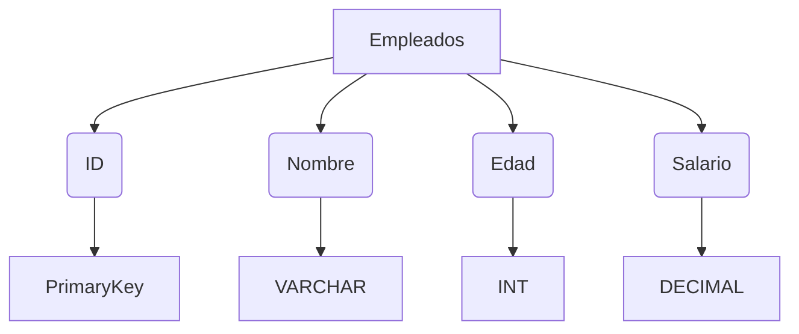
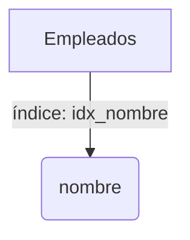
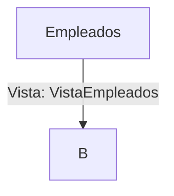
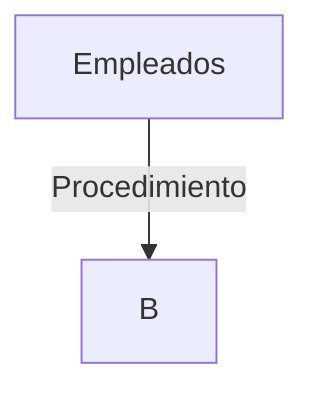
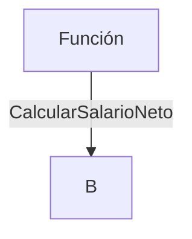
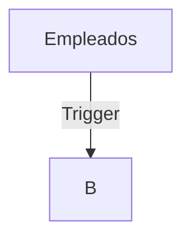
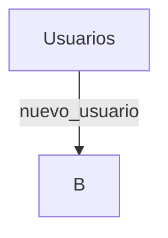
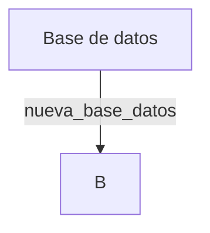

### 1. CREATE TABLE
La sentencia `CREATE TABLE` se utiliza para crear una nueva tabla en la base de datos. Aquí tienes un ejemplo detallado:
```sql
CREATE TABLE Empleados (
    id INT PRIMARY KEY,
    nombre VARCHAR(100),
    edad INT,
    salario DECIMAL(10, 2)
);

```
**Explicación**:
- Se define una tabla llamada `Empleados`.
- La tabla tiene cuatro columnas: 
1. `id` (clave primaria de tipo entero) 
2. `nombre` (cadena de caracteres de hasta 100 caracteres)
3. `edad` (entero) 
4. `salario` (decimal con 10 dígitos en total y 2 dígitos después del punto decimal).

#### Diagrama

****

### 2. CREATE INDEX
La sentencia `CREATE INDEX` se utiliza para crear un índice en una columna de una tabla, lo cual mejora la velocidad de búsqueda de registros:
```sql
CREATE INDEX idx_nombre ON Empleados (nombre);
```
**Explicación**:

- Crea un índice llamado `idx_nombre` en la columna `nombre` de la tabla `Empleados`.
- Los índices son estructuras auxiliares que aceleran las consultas SELECT y JOIN cuando se busca por la columna especificada.
##### Diagrama

### 3. CREATE VIEW
La sentencia `CREATE VIEW` se utiliza para crear una vista, que es una consulta almacenada como un objeto de base de datos:

```sql
CREATE VIEW VistaEmpleados AS
SELECT id, nombre, salario
FROM Empleados
WHERE salario > 3000;

```
**Explicación**:

- Crea una vista llamada `VistaEmpleados` que muestra los empleados con salarios mayores a 3000.
- Las vistas permiten almacenar consultas complejas y reutilizarlas fácilmente sin necesidad de escribir la consulta completa cada vez.
##### Diagrama

****


### 4. CREATE PROCEDURE
La sentencia `CREATE PROCEDURE` se utiliza para crear un procedimiento almacenado, que es un bloque de código SQL que se puede ejecutar varias veces:
```sql
CREATE PROCEDURE ObtenerEmpleadosMenorEdad(
    IN edad_max INT
)
BEGIN
    SELECT id, nombre
    FROM Empleados
    WHERE edad < edad_max;
END;

```
**Explicación**:

- Crea un procedimiento almacenado llamado `ObtenerEmpleadosMenorEdad` que toma un parámetro de entrada `edad_max`.
- El procedimiento selecciona y devuelve los empleados cuya edad es menor que `edad_max`.
##### Diagrama


****

### 5. CREATE FUNCTION
La sentencia `CREATE FUNCTION` se utiliza para crear una función, que es un bloque de código SQL que devuelve un valor específico:
```sql
CREATE FUNCTION CalcularSalarioNeto(
    salario_bruto DECIMAL(10, 2),
    impuestos DECIMAL(5, 2)
) RETURNS DECIMAL(10, 2)
BEGIN
    DECLARE salario_neto DECIMAL(10, 2);
    SET salario_neto = salario_bruto * (1 - impuestos / 100);
    RETURN salario_neto;
END;

```
**Explicación**:

- Crea una función llamada `CalcularSalarioNeto` que calcula el salario neto a partir del salario bruto y los impuestos proporcionados como parámetros.
- La función devuelve un valor decimal que representa el salario neto calculado.
##### Diagrama



****

### 6. CREATE TRIGGER
La sentencia `CREATE TRIGGER` se utiliza para crear un trigger, que es un tipo especial de procedimiento almacenado que se ejecuta automáticamente en respuesta a ciertos eventos en la base de datos:
```sql
CREATE TRIGGER DespuesInsertarEmpleado
AFTER INSERT ON Empleados
FOR EACH ROW
BEGIN
    INSERT INTO RegistroActividad (accion, fecha) VALUES ('Nuevo empleado insertado', NOW());
END;

```
**Explicación**:

- Crea un trigger llamado `DespuesInsertarEmpleado` que se activa después de cada inserción en la tabla `Empleados`.
- El trigger registra la acción de inserción en la tabla `RegistroActividad` junto con la fecha y hora actual.
##### Diagrama


****

### 7. CREATE USER
La sentencia `CREATE USER` se utiliza para crear un nuevo usuario en la base de datos:
```sql
CREATE USER 'nuevo_usuario'@'localhost' IDENTIFIED BY 'password';

```
**Explicación**:

- Crea un nuevo usuario llamado `nuevo_usuario` que puede conectarse desde `localhost` utilizando la contraseña especificada.
- Los usuarios permiten gestionar quién puede acceder y realizar acciones dentro de la base de datos.
##### Diagrama


****

### 8. CREATE DATABASE
La sentencia `CREATE DATABASE` se utiliza para crear una nueva base de datos:

```sql
CREATE DATABASE nueva_base_datos;

```
**Explicación**:

- Crea una nueva base de datos llamada `nueva_base_datos`.
- Las bases de datos son contenedores para tablas y otros objetos de base de datos, permitiendo la organización y gestión de datos de manera estructurada.
##### Diagrama

****
