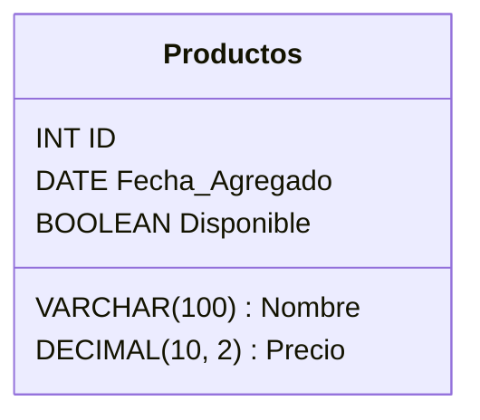

### Tipos de Datos en Bases de Datos

En una base de datos, cada columna de una tabla debe tener un tipo de dato definido. Los tipos de datos especifican el tipo de valores que pueden almacenarse en una columna. Los tipos de datos más comunes incluyen:

#### Tipos de Datos Numéricos

1. **INT**: Número entero.
    - **Ejemplo**: `123`
2. **FLOAT**: Número de punto flotante de precisión simple.
    - **Ejemplo**: `123.45`
3. **DOUBLE**: Número de punto flotante de doble precisión.
    - **Ejemplo**: `123.456789`
4. **DECIMAL**: Número decimal con una precisión fija.
    - **Ejemplo**: `123.45`

#### Tipos de Datos de Carácter

1. **CHAR(n)**: Cadena de caracteres de longitud fija `n`.
    - **Ejemplo**: `'abc'`
2. **VARCHAR(n)**: Cadena de caracteres de longitud variable hasta `n`.
    - **Ejemplo**: `'example'`

#### Tipos de Datos de Fecha y Hora

1. **DATE**: Fecha (año, mes, día).
    - **Ejemplo**: `2023-01-01`
2. **TIME**: Hora (hora, minuto, segundo).
    - **Ejemplo**: `12:34:56`
3. **DATETIME**: Combinación de fecha y hora.
    - **Ejemplo**: `2023-01-01 12:34:56`
4. **TIMESTAMP**: Marca de tiempo.
    - **Ejemplo**: `2023-01-01 12:34:56`

#### Tipos de Datos Lógicos

1. **BOOLEAN**: Valor lógico verdadero o falso.
    - **Ejemplo**: `TRUE` o `FALSE`

#### Tipos de Datos Binarios

1. **BINARY(n)**: Datos binarios de longitud fija `n`.
    - **Ejemplo**: `B'1010'`
2. **VARBINARY(n)**: Datos binarios de longitud variable hasta `n`.
    - **Ejemplo**: `B'101010'`

#### Ejemplos de Definición de Columnas con Tipos de Datos
```sql
CREATE TABLE Productos (
    ID INT PRIMARY KEY,
    Nombre VARCHAR(100),
    Precio DECIMAL(10, 2),
    Fecha_Agregado DATE,
    Disponible BOOLEAN
);
```

#### Ejemplo de Inserción de Datos con Tipos de Datos

```sql

INSERT INTO Productos (ID, Nombre, Precio, Fecha_Agregado, Disponible),
VALUES (1, 'Laptop', 999.99, '2024-07-01', TRUE);
```

#### Representación Gráfica de Tipos de Datos


