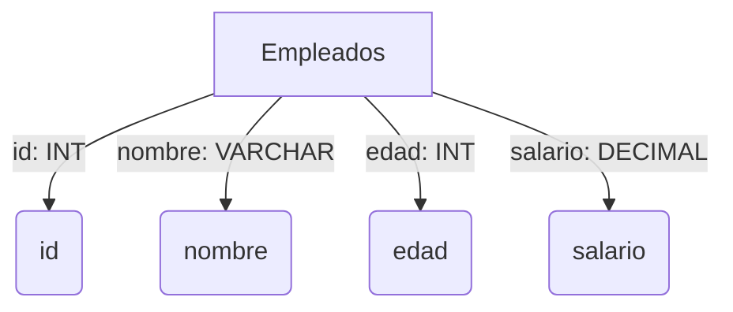
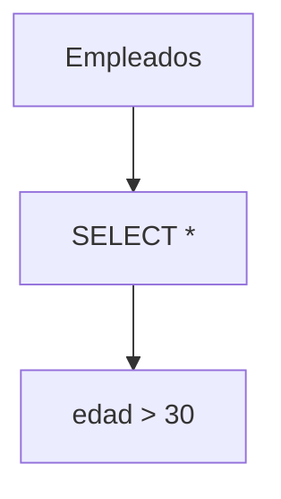

## Tipos de Sentencias SQL

### DDL (Data Definition Language)
- **CREATE**: Se utiliza para crear objetos en la base de datos como tablas, índices, vistas, procedimientos almacenados, etc.
- **ALTER**: Modifica la estructura de la base de datos existente, como alterar una tabla añadiendo o eliminando columnas.
- **DROP**: Elimina objetos de la base de datos, como tablas o índices.
- **TRUNCATE**: Elimina todos los registros de una tabla, pero no elimina la estructura de la tabla misma.
****


*Ejemplos:*
#### CREATE
Ejemplo de creación de una tabla en SQL:
```sql
CREATE TABLE Empleados (
    id INT PRIMARY KEY,
    nombre VARCHAR(100),
    edad INT,
    salario DECIMAL(10, 2)
);
```


#### TRUNCATE
Ejemplo de truncado de una tabla (elimina todos los registros pero mantiene la estructura):
```sql
TRUNCATE TABLE Empleados;
```
****

### DML (Data Manipulation Language)
- **SELECT**: Recupera datos de una o más tablas.
- **INSERT**: Inserta nuevos registros en una tabla.
- **UPDATE**: Modifica los registros existentes en una tabla.
- **DELETE**: Elimina registros de una tabla.


*Ejemplos:*
#### SELECT
Ejemplo de consulta para seleccionar datos de una tabla:
```sql
SELECT * FROM Empleados WHERE edad > 30;

```

****


### DCL (Data Control Language)
- **GRANT**: Otorga permisos de acceso a objetos de la base de datos a los usuarios.
- **REVOKE**: Retira los permisos concedidos previamente a los usuarios.


*Ejemplos:*
#### GRANT
Ejemplo de otorgamiento de permisos a un usuario:
```sql
GRANT SELECT, INSERT ON Empleados TO usuario1;
```
#### REVOKE

Ejemplo de revocación de permisos a un usuario:
```sql
REVOKE INSERT ON Empleados FROM usuario1;

```
****

### TCL (Transaction Control Language)
- **COMMIT**: Guarda las transacciones realizadas en la base de datos.
- **ROLLBACK**: Deshace las transacciones que no se han guardado en la base de datos.
- **SAVEPOINT**: Establece un punto en una transacción para la recuperación.
*Ejemplos:*
#### COMMIT
Ejemplo de confirmación de una transacción:
```sql
COMMIT;
```
#### ROLLBACK

Ejemplo de reversión de una transacción no confirmada:
```sql
ROLLBACK;
```
#### SAVEPOINT

Ejemplo de establecimiento de un punto de guardado en una transacción:
```sql
SAVEPOINT punto_guardado;

```
****
