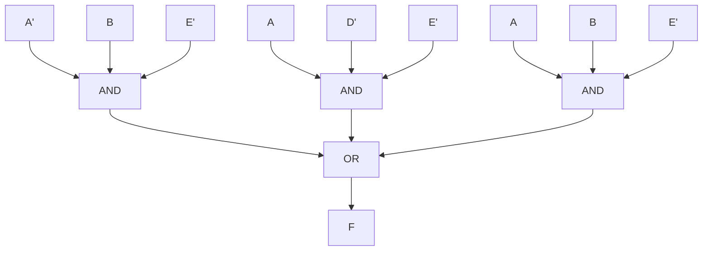

```mermaid
graph TD;
    A[A'] --> AND1;
    B[B] --> AND1;
    E[E'] --> AND1;
    AND1[AND] --> OR;

    A2[A] --> AND2;
    D[D'] --> AND2;
    E2[E'] --> AND2;
    AND2[AND] --> OR;

    A3[A] --> AND3;
    B3[B] --> AND3;
    E3[E'] --> AND3;
    AND3[AND] --> OR;

    OR[OR] --> F[F];
```

