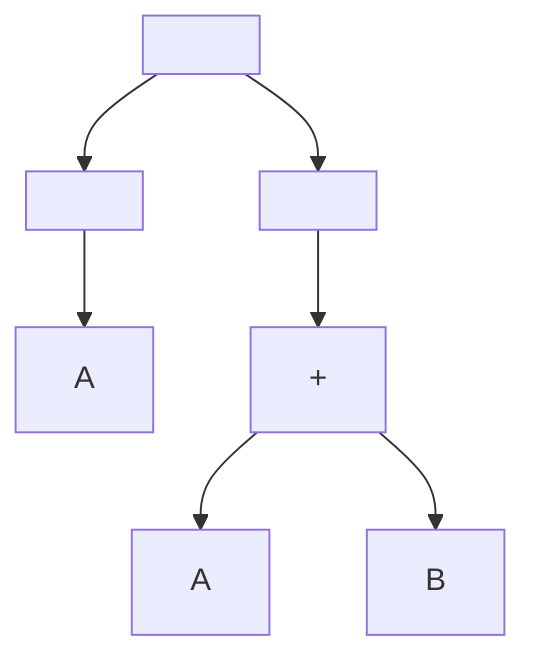
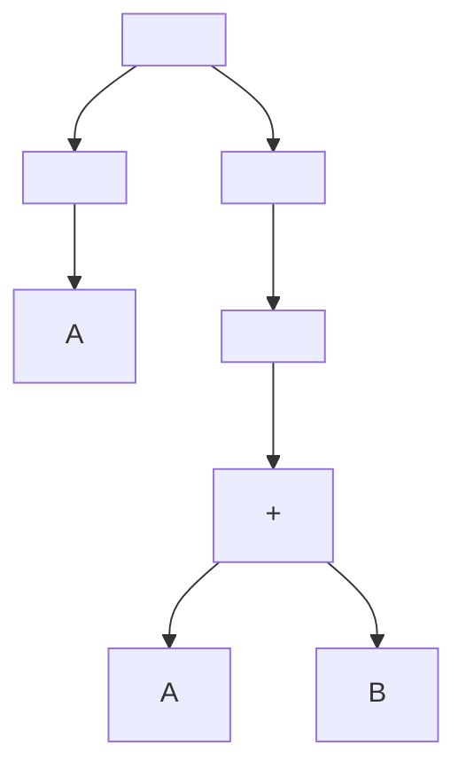

## 1. Gramática para números enteros, decimales, positivos y negativos

```bnf
<digit> ::= "0" | "1" | "2" | "3" | "4" | "5" | "6" | "7" | "8" | "9"
<integer> ::= <digit> | <digit> <integer>
<sign> ::= "+" | "-"
<number> ::= <sign>? <integer> ("." <integer>)?
```

Esta gramática permite generar:
- Números enteros (positivos o negativos): `-123`, `456`
- Números decimales: `-123.45`, `678.90`

## 2. Preguntas según el documento GLC.pdf de Canvas
#### a. ¿Qué es BNF? Proporcione un ejemplo.

**BNF (Backus-Naur Form)** es una técnica para describir la sintaxis de lenguajes de programación. Se utiliza frecuentemente para las gramáticas libres de contexto. BNF se caracteriza por las siguientes convenciones:
- Los no terminales se escriben entre paréntesis angulares `< >`.
- Los terminales se representan con cadenas de caracteres sin paréntesis angulares.
- El símbolo `::=` se lee como "se define como" o "se reescribe como".
  
Un ejemplo de BNF para una gramática que genera paréntesis anidados:

```
<cadena_par> ::= <cadena_par> <paréntesis> | <paréntesis>
<paréntesis> ::= () | ( <cadena_par> )
```

Esta gramática genera cadenas como `()`, `()()`, `(()())`, pero no genera cadenas inválidas como `(()`.

#### b. ¿Qué es un árbol de derivación?

Un **árbol de derivación** es una estructura gráfica que muestra cómo se puede derivar cualquier cadena de un lenguaje a partir del símbolo distinguido o axioma de una gramática que genera ese lenguaje. Cada nodo del árbol corresponde a un símbolo de la gramática (ya sea terminal o no terminal), y las ramas muestran cómo se aplican las reglas de producción de la gramática para transformar el axioma en una cadena terminal.

Propiedades de un árbol de derivación:
- Tiene un único nodo raíz etiquetado con el símbolo distinguido de la gramática.
- Cada nodo interior representa un símbolo no terminal, mientras que las hojas representan símbolos terminales.
- Cada rama del árbol representa la aplicación de una regla de producción.

#### c. ¿Qué son las hojas? ¿Nodo interior? ¿Nodo raíz?

- **Hojas**: Son los nodos que no tienen hijos, y representan los símbolos terminales de la gramática.
- **Nodo interior**: Son los nodos que tienen al menos un hijo y representan los símbolos no terminales en el proceso de derivación.
- **Nodo raíz**: Es el nodo superior del árbol, que representa el símbolo inicial o axioma de la gramática.

#### d. Genere dos salidas utilizando el ejemplo No. 6 de base.
Dos posibles árboles de derivación que se generan a partir de la expresión `A := A + B` serían los siguientes:

1. **Primer árbol de derivación**:
   - Sentencia: `A := A + B`
   - Árbol:


2. **Segundo árbol de derivación**:
   - Sentencia: `A := A + B`
   - Árbol:



Ambos árboles muestran la derivación de la sentencia `A := A + B`, pero con ligeras diferencias en la estructura.

Ambas salidas muestran la derivación de la misma sentencia `A := A + B`, pero con ligeras variaciones en el orden de descomposición. Puedes copiar estos diagramas en Mermaid dentro de Obsidian para visualizar los árboles de derivación.
---


#### e. ¿Qué es una gramática ambigua?

Una **gramática ambigua** es aquella en la que una misma cadena puede tener más de un árbol de derivación o, en otras palabras, más de una derivación izquierda o derecha. Esto significa que la cadena puede ser derivada de diferentes maneras a partir de la gramática, lo que puede llevar a interpretaciones múltiples y contradictorias en un lenguaje formal.
